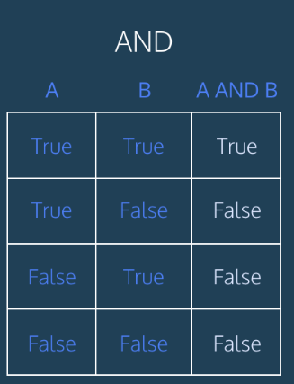
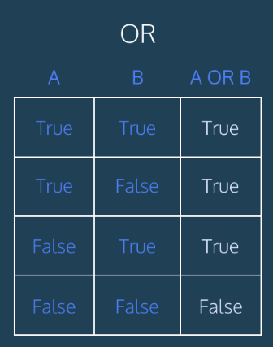

## Lab: SQL injection vulnerability in WHERE clause allowing retrieval of hidden data 
# [link lab-1](https://portswigger.net/web-security/sql-injection/lab-retrieve-hidden-data)


## 1.0 In this step, we identify the target parameter within the Query. This serves as the primary injection point for executing our SQLi payload

## 1.1 As we can see, the web application is behaving normally, with no suspicious activity or anomalies detected


## 1.2 In this stage, we select a parameter to analyze the underlying SQL query, which effectively helps us identify the potential injection point

## 1.3 Understanding how the website interacts with the MySQL database allows us to determine that the appropriate payload is
```bash
SELECT * FROM products WHERE category = 'Gifts' AND released = 1 
```

## 1.4 By appending the SQL payload ' OR 1=1 -- to the category parameter we manipulate the query logic to bypass the filter and retrieve all hidden products from the database


## 1.5 Why did we use a single quote (') in the payload [^1].
 
[^1]:This is the first step to verify if the website is vulnerable to Sql-injection

The application executes a SQL query like: 
SELECT * FROM products WHERE id='1'
When we inject an extra single quote ('), the query becomes: WHERE id='1''
This creates a syntax error because the database cannot determine
which quote is the closing delimiter. As a result, the server returns
a 500 Internal Server Error, confirming the injection point


## 1.6 now, let's see why we use OR instead of AND  
Because with OR if we have two values where one is true and the other is false, the result is true. In other words, if at least one value is true, the whole statement becomes true. This is the opposite of AND where if even a single value is false, the entire statement becomes false
 

## 1.7 and why use 1=1
We use 1=1 because it is always true. Since the OR operator only needs one condition to be true for the entire statement to work, the code will execute successfully. For example, if I provide a username like 'admin' OR 1=1, even if the username part returns false, the 1=1 part remains true. Therefore, the whole condition becomes true, and the bypass works
 

 use -- - as a comment operator in SQL. This means that everything following these characters is treated as a comment (decoration) and will be ignored by the database. The code becomes inactive and doesn't execute, which allows us to bypass the rest of the original query, such as the password check." 


> [!TIP]
> Helpful advice for doing things better or more easily.
 When writing an SQL injection payload, the process always begins with analyzing the original SQL query structure

```diff
 It  looks like this: - catrgory='Gifts' and released = 1 
 ```
 ```sql
 And you modify it to look like this: + catrgory='Gifts' or 1=1 -- -' and released =1 
 ```
## This results in the following malicious SQL query being executed
```sql
SELECT * FROM products WHERE category = 'Gifts'
```

# With this, I have successfully completed my first SQL Injection lab. By understanding the underlying database logic and manipulating the query, I was able to bypass security filters and access hidden data. This confirms the vulnerability and the importance of parameterized queries for defense