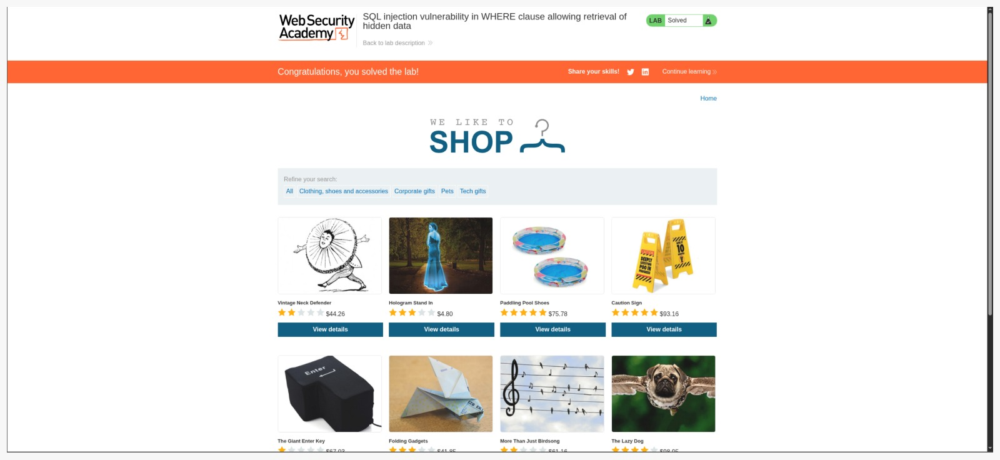
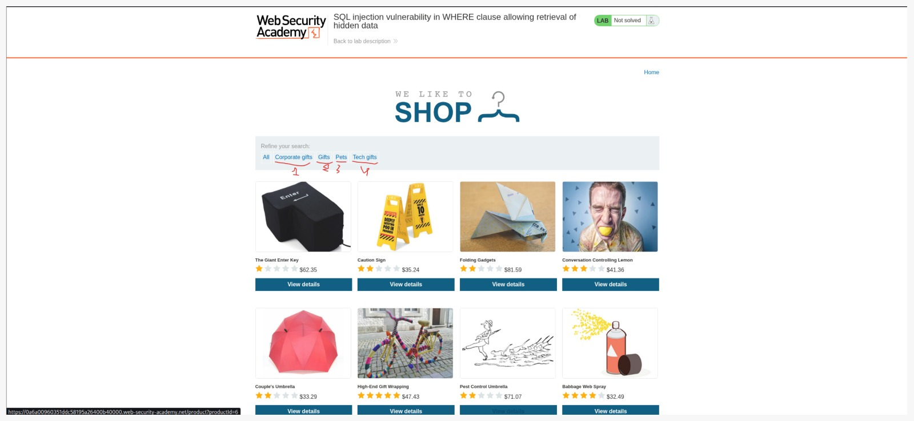
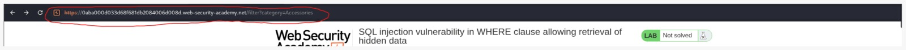
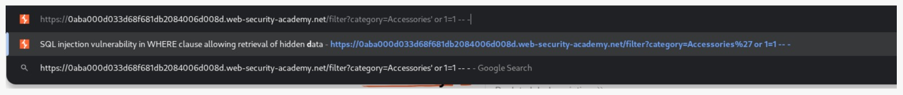
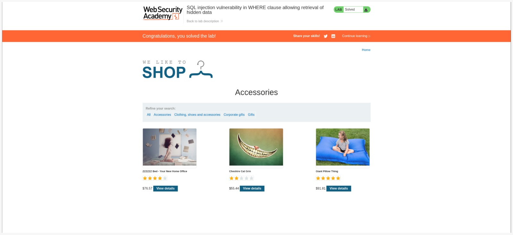

## Lab: SQL injection vulnerability in WHERE clause allowing retrieval of hidden data 
# [link lab-1](https://portswigger.net/web-security/sql-injection/lab-retrieve-hidden-data)


## 1.0 In this step, we identify the target parameter within the Query. This serves as the primary injection point for executing our SQLi payload

## 1.1 As we can see, the web application is behaving normally, with no suspicious activity or anomalies detected


## 1.2 In this stage, we select a parameter to analyze the underlying SQL query, which effectively helps us identify the potential injection point

## 1.3 Understanding how the website interacts with the MySQL database allows us to determine that the appropriate payload is
```bash
SELECT * FROM products WHERE category = 'Gifts' AND released = 1 
```

## 1.4 By appending the SQL payload ' OR 1=1 -- to the category parameter we manipulate the query logic to bypass the filter and retrieve all hidden products from the database

> [!TIP]
> Helpful advice for doing things better or more easily.
 When writing an SQL injection payload, the process always begins with analyzing the original SQL query structure

```bash
 It  looks like this: $\color #FF0000 catrgory='git' and released = 1 
 ```
 ```bash
 And you modify it to look like this: $\color #239b5d catrgory='git' or 1=1 -- -' and released =1 
 ```
## This results in the following malicious SQL query being executed
```bash
SELECT * FROM products WHERE category = 'Gifts'
```

# With this, I have successfully completed my first SQL Injection lab. By understanding the underlying database logic and manipulating the query, I was able to bypass security filters and access hidden data. This confirms the vulnerability and the importance of parameterized queries for defense